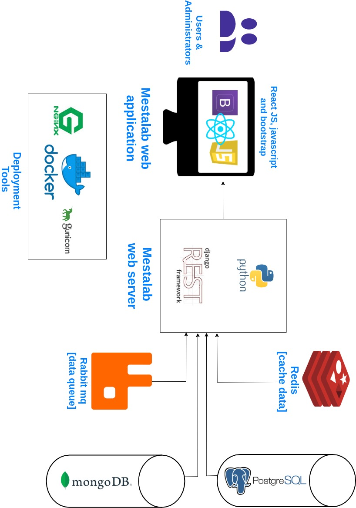

# My Projects Showcase

Welcome to my projects showcase! This file highlights some of the projects I've worked on, the technologies I used, and key features of each project. Feel free to explore and learn more about my work.

---

## Table of Contents
- [Project 1: Xendit - Indonesia Payment Gateway](#https://dashboard.xendit.co/login)
- [Project 2: Launch Legends](#)
- [Project 3: Hololens and AVP Boilerplate](#https://github.com/akkpuvvada/masters_project_avp)
- [Project 4: Idemia](#)
- [Project 5: Fluentd Docker](#project-3-project-title)
- [Project 6: mHealth Intervention VS Medical Intervention](#https://easychair.org/conferences2/overview?a=31142230)
- [Project 7: Docker Hadoop](#https://github.com/akkpuvvada/docker-hadoop)
- [Project 8: React Storybook](#https://github.com/geekolance/storybook_poc)
- [Project 9: FCode Essentials](#)

---

## Project 1: Xendit
### Overview
At Xendit, I developed a scalable UI component library using React Storybook with TypeScript. This involved converting Figma designs into reusable TypeScript-based React components, ensuring type safety and consistency across applications. Additionally, I worked on a POC for Microfrontend Architecture, which was later implemented on a cloud platform to enable independent deployment of UI modules.

### Technologies Used
- **React (JavaScript)** – Strongly typed UI components
- **Storybook (JavaScript)** – Component development & documentation
- **Microfrontend Architecture** – Modular frontend development
- **Webpack Module Federation** – Dynamically loading microfrontends
- **Cloud Deployment (AWS/Azure/GCP)** – Hosting microfrontends independently
- **Figma** - Design reference & UI implementation
- **GitHub** - Version control & package distribution

### Features
- **Developed a TypeScript-based UI Component Library** – Strongly typed reusable React components.
- **Converted Figma Designs to TypeScript Components** – Ensured pixel-perfect UI implementation.
- **Implemented Storybook for Component Testing** – Enabled isolated development and documentation.
- **POC for Microfrontend Architecture** – Explored & validated a strategy for modular frontend applications.
- **Deployed Microfrontends to Cloud** – Enabled independent deployment of UI modules.

### Screenshots

> *Tip: Replace the image path with your actual screenshot file path or URL.*

### Links
- **Live Demo:** [View Demo](- **Live Demo:** [View Demo](http://your-live-demo-link.com))

---

## Project 2: Storybook
### Overview
This project is a Storybook-based UI Component Library developed to streamline UI development, testing, and documentation. The goal was to create reusable React components in isolation, ensuring consistency and faster development across multiple projects. Components were also published on GitHub for easy integration into other applications.

### Technologies Used
- **React 17 – For building UI components**
- **Storybook 6 – For component development and visualization**
- **GitHub – For version control and package distribution**
- **NPM – For managing dependencies**

### Features
- **Component Isolation – Develop and test UI components independently without running the entire application.**
- **Reusable UI Library – Components can be installed and used in different projects.**
- **Live Component Documentation – Visual previews and prop controls make it easier to understand component behavior.**
- **Addon Support – Enhanced debugging with event tracking and interactive prop manipulation.**
- **GitHub Publishing – Components are stored in a GitHub repository and installed directly in other projects.**

### Links
- **Live Demo:** [View Demo](https://github.com/geekolance/new_stroybook)
- **Source Code:** [GitHub Repository](http://localhost:6006/?path=/story/form-button--primary-3)

---

## Project 3: Project Title
*(Repeat similar structure as above for additional projects)*

---

## Contact
If you’d like to get in touch, please feel free to reach out:

- **Email:** [your.email@example.com](mailto:your.email@example.com)
- **LinkedIn:** [Your LinkedIn Profile](http://linkedin.com/in/yourprofile)

---

*Thank you for checking out my projects!*
